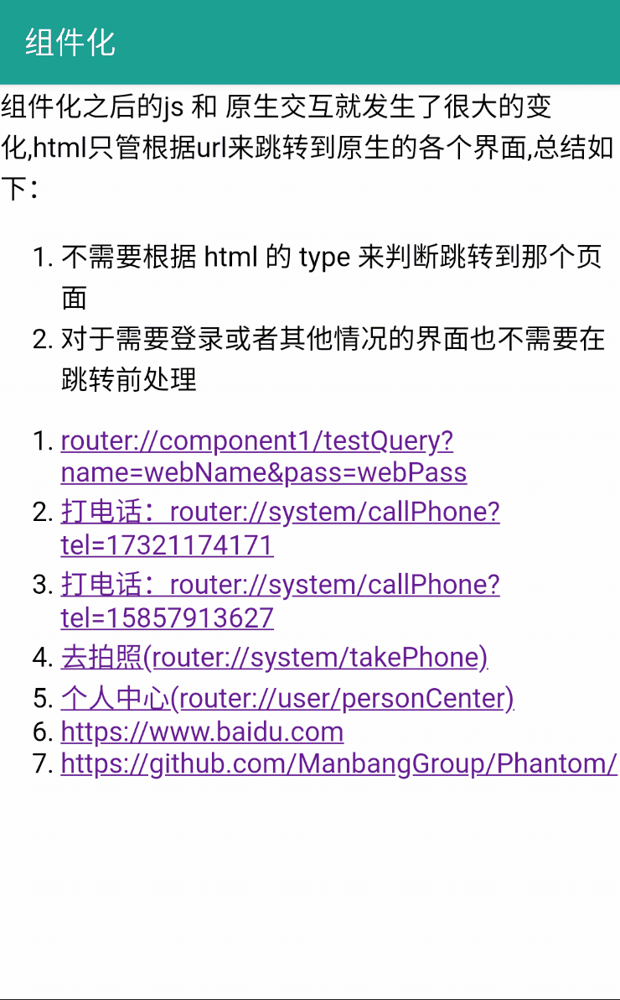
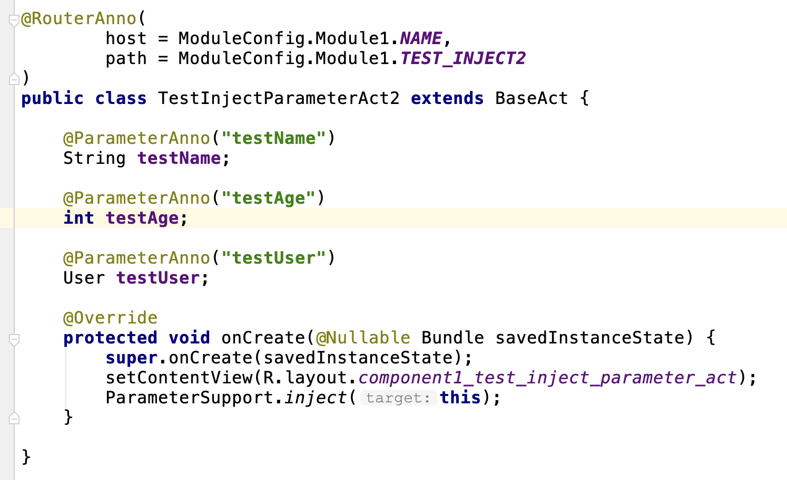

Component
------------

组件化方案真的有很多,那么这个组件化方案优秀在哪里？相比于 `ARouter`,`WMRouter`,`ActivityRouter`,`CC`,`DDComponent`
等开源的组件化框架,有哪些一样或者优秀的点

- 整个设计贴近原生,对原生的代码入侵极少,尽最大的可能保留原生的代码
- 在一些路由拦截器的执行线程的设计上,考虑到用户平时书写的 `90%` 代码都是在主线程的,<br/>所以路由拦截器的执行线程也设计为主线程执行,可以让您放心的操作 `UI`、弹框等操作.<br/>同时提供 `Callback` 机制可以在拦截器中做任何耗时的任务<br/>这点绝对是压倒性的优势
- 配套的 `Idea Plugin` 方便快速浏览,持续会更新此插件
- 路由的取消,基本上没有路由框架支持路由的取消,这也是一个很大的优势
    - 可以手动用代码取消
    - 路由自动取消,当发起路由的 `Fragment` 或者 `Activity` 销毁的时候会取消
- 拦截器的种类有三种,足矣满足所有业务情况(具体看wiki)
    - 自定义拦截器
    - 页面拦截器
    - 全局拦截器
- 目标界面的参数注入(目前仅支持基本数据类型,后续会支持Bundle中的所有类型)
- 跳转
    - 自定义跳转(这样子就支持了第三方和系统的界面)
    - 自定义 `Intent`
- 无缝对接 `H5`
-  **0** 配置可以拿到目标界面返回的 `ActivityResult`,很多框架不支持或者需要入侵 `BaseActivity`
- 服务发现和路由分开设计
    - 其实这两块本来就是两个方面,我不清楚为什么很多方案中都柔和在一块
- Rx扩展库扩展完美结合了 RxJava2

如何使用
--------------

- [依赖和配置](https://github.com/xiaojinzi123/Component/wiki/%E4%BE%9D%E8%B5%96%E5%92%8C%E9%85%8D%E7%BD%AE)
- 跳转
    - [跳转-接口路由的方式](https://github.com/xiaojinzi123/Component/wiki/%E8%B7%B3%E8%BD%AC-%E6%8E%A5%E5%8F%A3%E8%B7%AF%E7%94%B1%E7%9A%84%E6%96%B9%E5%BC%8F)
    - [跳转-使用代码跳转](https://github.com/xiaojinzi123/Component/wiki/%E8%B7%B3%E8%BD%AC-%E4%BD%BF%E7%94%A8%E4%BB%A3%E7%A0%81%E8%B7%B3%E8%BD%AC)
- [Activity注解使用](https://github.com/xiaojinzi123/Component/wiki/RouterAnno%E6%B3%A8%E8%A7%A3%E6%A0%87%E8%AE%B0%E7%9B%AE%E6%A0%87%E7%9A%84%E9%AB%98%E7%BA%A7%E7%94%A8%E6%B3%95)
- [拦截器](https://github.com/xiaojinzi123/Component/wiki/%E6%8B%A6%E6%88%AA%E5%99%A8)
- [服务发现实现跨模块调用](https://github.com/xiaojinzi123/Component/wiki/%E8%B7%A8%E6%A8%A1%E5%9D%97%E8%B0%83%E7%94%A8%E7%9A%84%E6%9C%8D%E5%8A%A1%E5%8F%91%E7%8E%B0%E5%8A%9F%E8%83%BD)
- [名词解释](https://github.com/xiaojinzi123/Component/wiki/%E5%90%8D%E8%AF%8D%E8%A7%A3%E9%87%8A)
- [基本介绍](https://github.com/xiaojinzi123/Component/wiki/%E5%9F%BA%E6%9C%AC%E4%BB%8B%E7%BB%8D%E5%92%8C%E6%9E%B6%E6%9E%84%E4%BB%8B%E7%BB%8D)

**了解更多请看 [wiki](https://github.com/xiaojinzi123/Component/wiki/) 更多功能等你来发现**


```
// 声明式路由接口调用
Router.withApi(AppApi.class).goToTestWebRouter(this);
```






RouterGoPlugin
----------

[一个帮助您识别路由和拦截器的库,减少您查找的时间,配合组件化使用](https://github.com/xiaojinzi123/RouterGoPlugin)

为了更好的能交流,这里新建了一个QQ群：870981195
或者扫描二维码来进群

<div>


</div>

License
-------

    Licensed under the Apache License, Version 2.0 (the "License");
    you may not use this file except in compliance with the License.
    You may obtain a copy of the License at

       http://www.apache.org/licenses/LICENSE-2.0

    Unless required by applicable law or agreed to in writing, software
    distributed under the License is distributed on an "AS IS" BASIS,
    WITHOUT WARRANTIES OR CONDITIONS OF ANY KIND, either express or implied.
    See the License for the specific language governing permissions and
    limitations under the License.
